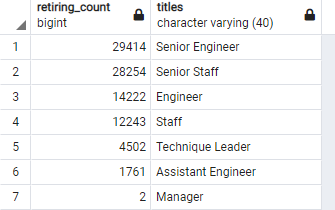
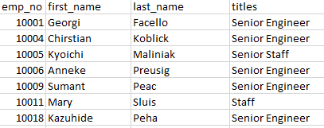
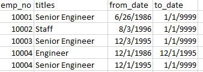
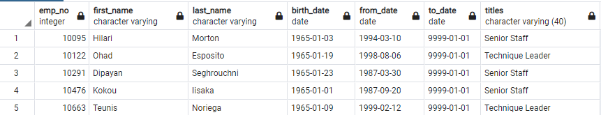

#Module 7: Employee Database with SQL
## Resources

- **Data Sources:** 
  - [departments.csv](Resources/departments.csv)
  - [dept_emp.csv](Resources/dept_emp.csv)
  - [dept_manager.csv](Resources/dept_manager.csv)
  - [employees.csv](Resources/employees.csv)
  - [titles.csv](Resources/titles.csv)
  - [salaries.csv](Resources/salaries.csv)
- **Software:** PostgresSQL, PgAdmin, QuickDB, SQL

## Challenge Project Overview 

Pewlett Hackard wants to conduct a research project on employees of the corporation from the 1980s and 1990s. All that remains in the database of employees from that period are six CSV files. They want me to create some tables to identify which employees are about to retire and which employees should shift into a mentorship program.

Using PostgreSQL techniques, I performed data modeling and completed analysis on Pewlett Hackard's employee database. First, I created an entity-relationship diagram (ERD) using QuickDB to design our database. Using PostgresSQL, I imported large CSV datasets into pgAdmin to create tables, queries and execute joins to use that data to answer questions asked by Pewlett Hackard's. Finally, we exported the results in CSVs for the client.

## Challange Project Analysis
1) **retiring_titles:** shows that 57,668 positions of all the retirement-eligible titles are senior positions which makes a majority of retiring positions. 
  - [retiring_titles.csv](retiring_titles.csv)
  - 
2) **unique_titles:** shows the most recent title for employees of retirement age.
  - [unique_titles.csv](unique_titles.csv)
  - 
3) **retirment_titles table:** every eligible for retirement employee and how long they have worked at each position
  - [retirement_titles.csv](retirement_titles.csv)
  - 
4) **retirment_titles table:** shows mentorship eligibility that holds the current employees born between January 1, 1965, and December 31, 1965.
  - [mentorship_eligibility.csv](mentorship_eligibility.csvv)
  - 

## Challange Project Summary
As 57,668 positions are Senior positions who are retiring, so there will be a skilled laborer gap. The new mentorship eligibility tables hold the solution. The sooner we can induct the Senior positions into the mentorship program, we pivot their skills sets to train the next generations of Senior positions.  

